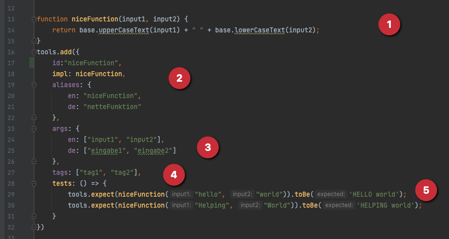

# Toolbox Extension Template

## English description
[Link zur deutschen Beschreibung](#deutsche-beschreibung)

- Create a new repository in GitLab and copy all the stuff from this template to it.
- Run `npm install` first time
- Run `npm test` to run all the tests
- To add a new tool just edit ``extension.js``.
  There is an example tool called ``niceFunction``. The tools are written in JavaScript.

1. Here is the function itself. JavaScript is fully available, tools from the base package can be used with a prefix ``base.``. In this example ``upperCaseText`` and ``lowerCaseText`` from the base package are used.
   With ``return`` the calculated value is returned.
2. Following is the information for chioro to manage the function:

   ``impl`` is the name of the function and must match the name in javascript

   ``aliases`` are the names of the function in the respective language. These names are displayed in the toolbox.

3. ``args`` are the input variables in the respective language.

4. ``tags`` any tags can be added. Tags are optional.
5. ``tests`` any number of tests can be added. With ``npm test`` the validity of the tests is checked.

## Deutsche Beschreibung

- Erstellen Sie ein neues Repository in GitLab und kopieren Sie alles aus dieser Vorlage dorthin.
- Führen Sie `npm install` zum ersten Mal aus
- Führen Sie `npm test` aus, um alle Tests zu starten.
- Um ein neues Werkzeug hinzuzufügen, editieren Sie einfach ``extension.js``.
  Es gibt ein Beispielwerkzeug namens ``niceFunction``. Die Werkzeuge sind in JavaScript geschrieben.

1. Hier steht die Funktion selber. JavaScript steht in vollem Umfang zur Verfügung, Werkzeuge aus dem Basis-Paket können mit einem vorangestellten ``base.`` verwendet werden. In diesem Beispiel werden ``upperCaseText``und ``lowerCaseText`` aus dem Basis-Paket verwendet.
   Mit return wird der berechnete Wert zurückgegeben.
2. Es folgen die Informationen für chioro um die Funktion zu verwalten:

   ``impl`` ist der Name der Funktion und muss dem Namen in Javascript entsprechen

   ``aliases`` sind die Namen der Funktion in der jeweiligen Sprache. Diese Namen werden in der Toolbox angezeigt.

3. ``args`` sind die Eingabe-Variablen in der jeweiligen Sprache

4. ``tags`` beliebige Tags können hinzugefügt werden. Tags sind optional.
5. ``tests`` Es können beliebig viele Tests hinzugefügt werden. Mit ``npm test`` wird die Gültigkeit der Tests überprüft.
